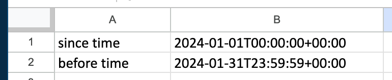

# How to use?
1. Copy the entire code
2. Replace the list id and api key in the code with your Mailchimp setup
3. Create two cells with start and end date as shown in screenshot below

# Why is this better?
1. Fetches subject lines, which mailchimp reports don't. How are we supposed to assess performance, when subject line is key in determining open rates.
2. Fetches a preview url, which is handy for quick preview right from the google sheet
3. You can add whatever you want if you know some coding!

# Help?
Contact me, or file an issue in the repository if you have any questions or need help.
